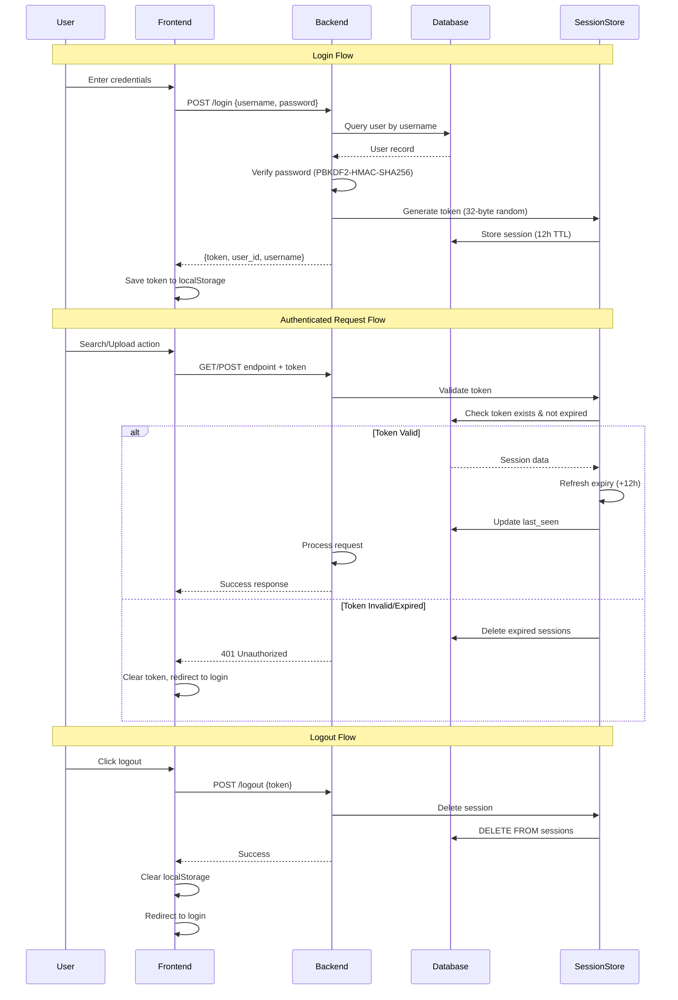

# 🔍 Image Search Application

Enterprise-grade semantic image search application with microservices architecture. Upload images, create folders, and search using natural language queries powered by AI.

[](https://www.java.com/)
[](https://spring.io/projects/spring-boot)
[](https://www.python.org/)
[](https://reactjs.org/)
[](https://www.postgresql.org/)

## Key Highlights

- **Microservices Architecture**: Java Spring Boot backend orchestrating Python AI microservice
- **RESTful API Design**: Clean, resource-based endpoints following REST principles
- **AI-Powered Search**: OpenAI CLIP model generates 512-dimensional embeddings for semantic understanding
- **Lightning-Fast Search**: FAISS IndexFlatIP performs cosine similarity search on millions of vectors
- **Production Database**: PostgreSQL with JPA/Hibernate ORM and proper transaction management
- **Enterprise Security**: BCrypt password hashing + session-based authentication with sliding expiration
- **Layered Architecture**: Clear separation of concerns (Controller → Service → Repository → Entity)
- **Global Exception Handling**: Centralized error handling with @ControllerAdvice (similar to Spring's best practices)
- **Multi-Tenant Platform**: Complete user isolation with granular folder sharing permissions

## Features

- **Bulk Image Upload**: Drag & drop multiple images with background CLIP processing
- **Natural Language Search**: Query like "sunset over mountains" or "red sports car"  
- **Folder Organization**: Create, manage, and share image collections
- **Real-Time Collaboration**: Share folders with other users instantly
- **Session Management**: Auto-expiring tokens with sliding window refresh

## Architecture

### Microservices Architecture

This application demonstrates a **professional microservices architecture** with clear separation of concerns:

```
┌─────────────────────┐
│   React Frontend    │  Port 3000
│   (User Interface)  │
└──────────┬──────────┘
           │ HTTP REST
           ▼
┌─────────────────────┐
│   Java Backend      │  Port 8080
│   (Spring Boot)     │
│                     │
│  ┌───────────────┐  │
│  │ Controllers   │  │  RESTful API Layer
│  ├───────────────┤  │
│  │ Services      │  │  Business Logic
│  ├───────────────┤  │
│  │ Repositories  │  │  Data Access
│  ├───────────────┤  │
│  │ Entities      │  │  JPA Models
│  └───────────────┘  │
└──────┬────────┬─────┘
       │        │
       │        │ HTTP (WebClient)
       │        ▼
       │   ┌─────────────────────┐
       │   │ Python Search       │  Port 5000
       │   │ Microservice        │
       │   │                     │
       │   │ • CLIP Embeddings   │
       │   │ • FAISS Search      │
       │   │ • Vector Indexing   │
       │   └─────────────────────┘
       │
       ▼
┌──────────────┐
│ PostgreSQL   │  Port 5432
│              │
│ • Users      │
│ • Folders    │
│ • Images     │
│ • Sessions   │
│ • Shares     │
└──────────────┘
```

### Technology Stack

#### **Java Backend (Spring Boot)**
- **Framework**: Spring Boot 3.2, Spring Data JPA, Spring WebClient
- **Build Tool**: Gradle 8.5
- **Language**: Java 17
- **Database**: PostgreSQL 15 with Hibernate ORM
- **Security**: BCrypt password hashing, session-based authentication
- **Architecture**: Layered (Controller → Service → Repository → Entity)

**Responsibilities:**
- User authentication and session management
- Folder and image metadata management
- Authorization and access control
- HTTP orchestration with Python microservice
- RESTful API for React frontend

#### **Python Search Microservice (FastAPI)**
- **Framework**: FastAPI 0.104
- **AI Model**: OpenAI CLIP (ViT-B/32)
- **Vector Search**: FAISS (Facebook AI Similarity Search)
- **ML Framework**: PyTorch 2.1

**Responsibilities:**
- Generate CLIP embeddings for images and text
- Manage FAISS vector indexes
- Perform semantic similarity search
- Return ranked image IDs with scores

#### **React Frontend**
- **Framework**: React 18 with functional components
- **Styling**: Modern CSS with responsive design
- **API Communication**: Fetch API with centralized error handling

**Responsibilities:**
- User interface and experience
- Form validation and file upload
- API calls to Java backend (NOT Python service)


## Quick Start (Local Development)

> 📌 **See [HOW_TO_SWITCH_BACKENDS.md](HOW_TO_SWITCH_BACKENDS.md) for complete switching guide**
>
> 📌 **See [PORTS_AND_ARCHITECTURE.md](PORTS_AND_ARCHITECTURE.md) for port configuration details**

### Prerequisites
- **Java 17+** ([Download OpenJDK](https://adoptium.net/))
- **PostgreSQL 15+** ([Installation guide](POSTGRESQL_SETUP.md))
- **Python 3.12+** with pip
- **Node.js 18+** with npm
- 4GB+ RAM (CLIP model requires ~2GB)

### 1. Database Setup

```bash
# Install and start PostgreSQL (see POSTGRESQL_SETUP.md for details)
sudo apt install postgresql  # Ubuntu/Debian
# or
brew install postgresql@15   # macOS

# Create database
sudo -u postgres psql
CREATE DATABASE imagesearch;
CREATE USER imageuser WITH PASSWORD 'your_password';
GRANT ALL PRIVILEGES ON DATABASE imagesearch TO imageuser;
\q
```

### 2. Python Search Microservice

```bash
# Navigate to search service
cd search-service

# Create virtual environment
python3 -m venv venv
source venv/bin/activate  # or `venv\Scripts\activate` on Windows

# Install dependencies (includes CLIP, FAISS, PyTorch)
pip install -r requirements.txt

# Start the service (runs on port 5000)
python app.py
```

### 3. Java Backend

```bash
# Navigate to Java backend
cd java-backend

# Configure database (edit src/main/resources/application.yml)
# Or use environment variables:
export DB_USERNAME=imageuser
export DB_PASSWORD=your_password

# Run with Gradle
./gradlew bootRun

# Backend will start on port 8080
```

### 4. React Frontend

```bash
# Navigate to frontend
cd frontend

# Install dependencies
npm install

# Start development server (runs on port 3000)
npm start
```

### 5. Access the Application

- **Frontend**: http://localhost:3000
- **Java Backend API**: http://localhost:8080
- **Python Search Service**: http://localhost:5000

## How It Works

### 1. User Registration/Login
```
React → POST /api/users/register → Java Backend
                                   ↓
                                PostgreSQL (users table)
                                   ↓
                          ← BCrypt hashed password
                          ← Session token created
```

### 2. Image Upload Flow
```
React → POST /api/images/upload → Java Backend
         (multipart/form-data)      ↓
                                    Save to filesystem
                                    Create DB record (PostgreSQL)
                                    ↓
                            POST /embed-images → Python Service
                                                  ↓
                                            Generate CLIP embedding
                                            Add to FAISS index
```

### 3. Image Search Flow
```
React → GET /api/images/search?query=sunset → Java Backend
                                                  ↓
                                          Get accessible folders (PostgreSQL)
                                          Build folder ownership map
                                                  ↓
                                          POST /search → Python Service
                                                         ↓
                                                   CLIP text embedding
                                                   FAISS similarity search
                                                   ← Return image IDs + scores
                                          ← Enrich with metadata
                                          ← Image URLs + scores
React ← JSON response with results
```

## API Documentation

### Java Backend Endpoints

#### **User Management**
- `POST /api/users/register` - Create new user account
- `POST /api/users/login` - Authenticate and get session token
- `POST /api/users/logout` - Invalidate session
- `DELETE /api/users/account` - Delete user account

#### **Folder Management**
- `GET /api/folders?token=xxx` - Get all accessible folders
- `DELETE /api/folders` - Delete folders (with DB + FAISS cleanup)
- `POST /api/folders/share` - Share folder with another user
- `GET /api/folders/shared?token=xxx` - Get folders shared with me

#### **Image Operations**
- `POST /api/images/upload` - Upload images to folder
- `GET /api/images/search?query=xxx&token=xxx` - Semantic search

### Python Microservice Endpoints (Internal - called by Java)

- `POST /search` - Perform FAISS similarity search
- `POST /embed-images` - Generate embeddings for uploaded images
- `POST /create-index` - Create new FAISS index for folder
- `DELETE /delete-index/{user_id}/{folder_id}` - Delete FAISS index

### Frontend Setup
```bash
cd frontend
npm install
npm start  # Runs on port 3000, proxies API to :9999
```

## Usage Guide

> **First Time Setup**: The app starts with an empty database. Simply register a new account to begin!

### 1. Register & Login
- Create an account with username/password (e.g., `demo` / `demo123`)
- Login to receive authentication token (stored in localStorage)

### 2. Create Folders
- Click "Manage Folders" → "Create Folder"
- Enter folder name (e.g., "Vacation Photos", "Work Documents")

### 3. Upload Images
- Select a folder from the upload panel
- Choose multiple images (JPG, PNG)
- Images are automatically embedded using CLIP

### 4. Search Images
- Enter natural language query (e.g., "sunset over mountains", "red car")
- Optionally select specific folders to search
- View top matching images with similarity scores

### 5. Share Folders
- Click "Share Folder"
- Enter username and permission level (view/edit)
- Shared users can search (and upload if edit permission)

## Project Structure

```
image-search-app/
├── python-backend/
│   ├── api.py                  # FastAPI app entry point
│   ├── database.py             # PostgreSQL operations
│   ├── faiss_handler.py        # FAISS index management
│   ├── utils.py                # CLIP embedding generation
│   ├── security.py             # Password hashing
│   ├── routes/
│   │   ├── user_routes.py      # Register/login/logout
│   │   ├── images_routes.py    # Upload/search/folders
│   │   └── sharing_routes.py   # Folder sharing
│   ├── images/                 # Uploaded images (volume)
│   ├── faisses_indexes/        # FAISS indexes (volume)
│   └── Dockerfile
│
├── java-backend/
│   ├── src/main/java/com/imagesearch/
│   │   ├── controller/         # REST endpoints
│   │   ├── service/            # Business logic
│   │   ├── repository/         # Data access (JPA)
│   │   ├── model/              # Entities and DTOs
│   │   └── client/             # Microservice clients
│   └── build.gradle            # Gradle build config
│
├── search-service/
│   └── app.py                  # Python search microservice
│
├── frontend/
│   ├── src/
│   │   ├── App.jsx             # Main component
│   │   └── components/
│   │       ├── Login.jsx
│   │       ├── SearchImages.jsx
│   │       ├── UploadImages.jsx
│   │       ├── GetFolders.jsx
│   │       ├── ShareFolder.jsx
│   │       └── SharedWithMe.jsx
│   ├── nginx.conf              # Production web server config
│   └── Dockerfile
│
└── docker-compose.yml          # Multi-container orchestration
```

## Configuration

### Environment Variables (Backend)

```bash
STORAGE_BACKEND=local  # Options: 'local' or 'aws'

# For AWS S3 storage (optional)
AWS_ACCESS_KEY_ID=your_key
AWS_SECRET_ACCESS_KEY=your_secret
AWS_BUCKET_NAME=your_bucket
AWS_REGION=us-east-1
```

## Docker Details

### Image Sizes
- Backend: ~1.8GB (includes Python + CLIP model + FAISS)
- Frontend: ~25MB (multi-stage build with Nginx)

### Volumes (Data Persistence)
```yaml
./backend/images → /app/images                        # Uploaded images
./backend/faisses_indexes → /app/faisses_indexes      # FAISS indexes
backend-db (named volume) → /app/data                 # SQLite database
```


### AWS S3 Integration Details

```
┌─────────────────────────────────────────────────────────────┐
│                        AWS S3 Bucket                        │
├─────────────────────────────────────────────────────────────┤
│  Structure: images/{user_id}/{folder_id}/{filename}         │
│                                                             │
│  ├── images/1/3/dogs_200/dog_abc123.jpg                   │
│  ├── images/1/3/dogs_200/dog_def456.jpg                   │
│  ├── images/2/5/cats/cat_xyz789.jpg                       │
│  └── ...                                                   │
│                                                             │
│  Features:                                                  │
│  • Presigned URLs (60s expiry) for secure access          │
│  • Automatic content-type detection                        │
│  • Scalable storage for millions of images                 │
│  • Cross-region replication ready                          │
└─────────────────────────────────────────────────────────────┘
```

### FAISS Index Structure

```
Per-User, Per-Folder Indexes:
faisses_indexes/
├── 1/                          # User ID 1
│   ├── 3.faiss                 # Folder ID 3 index
│   ├── 4.faiss                 # Folder ID 4 index
│   └── ...
├── 2/                          # User ID 2
│   ├── 5.faiss                 # Folder ID 5 index
│   └── ...
└── ...

Each .faiss file contains:
• IndexFlatIP (Inner Product for normalized vectors)
• 512-dimensional CLIP embeddings
• Mapping: vector_position → image_id
• Optimized for cosine similarity search
```

### Database Schema

```
    users ||--o{ folders : owns
    users ||--o{ images : owns
    users ||--o{ sessions : has
    users ||--o{ folder_shares : "shares from"
    users ||--o{ folder_shares : "receives shares"
    folders ||--o{ images : contains
    folders ||--o{ folder_shares : "shared"
    
    users {
        int id PK
        string username UK
        string password_hash
        datetime created_at
    }
    
    folders {
        int id PK
        int user_id FK
        string folder_name
        unique(user_id, folder_name)
    }
    
    images {
        int id PK
        int user_id FK
        int folder_id FK
        string filepath
    }
    
    sessions {
        string token PK
        int user_id FK "CASCADE"
        datetime expires_at
        datetime last_seen
    }
    
    folder_shares {
        int id PK
        int folder_id FK
        int owner_id FK
        int shared_with_user_id FK
        string permission "view/edit"
    }
```

**Key Constraints:**
- `folders`: UNIQUE constraint on `(user_id, folder_name)` - prevents duplicate folder names per user
- `sessions`: CASCADE DELETE on `user_id` - sessions automatically deleted when user is deleted
- Foreign keys enabled globally: `PRAGMA foreign_keys = ON`

### Authentication Flow




## License

MIT License - see [LICENSE](LICENSE) file for details

## Author

**Tal Alter**
- GitHub: [@talalter](https://github.com/talalter)
- LinkedIn: [linkedin.com/in/tal-alter](https://linkedin.com/in/tal-alter) <!-- Update with your actual LinkedIn URL -->
- Email: talalter95900@gmail.com 

---

**If you found this project interesting, please consider giving it a star!**

## Acknowledgments

- **OpenAI CLIP** - Image embedding model
- **FAISS** - Facebook AI Similarity Search
- **FastAPI** - Modern Python web framework
- **React** - Frontend UI library