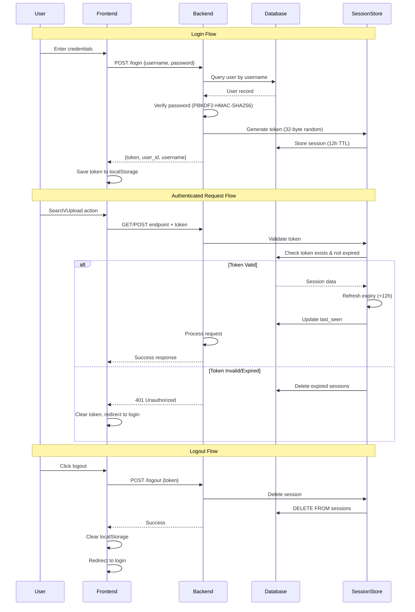

# 🔍 Image Search Application

Semantic image search using CLIP embeddings and FAISS vector similarity. Upload images, create folders, and search using natural language queries to find visually similar images.

[](https://www.python.org/)
[](https://reactjs.org/)
[](https://fastapi.tiangolo.com/)
[](https://www.docker.com/)

## Key Highlights

- **AI-Powered Search**: OpenAI CLIP model generates 512-dimensional embeddings for semantic understanding
- **Lightning-Fast Search**: FAISS IndexFlatIP performs cosine similarity search on millions of vectors
- **Cloud-Ready Storage**: Seamlessly switch between local filesystem and AWS S3 with presigned URLs
- **Production-Ready**: Docker + Nginx deployment with multi-stage builds and health checks
- **Enterprise Security**: PBKDF2-HMAC-SHA256 (390k iterations) + session tokens with auto-refresh
- **Multi-Tenant Platform**: Complete user isolation with granular folder sharing (view/edit permissions)
- **Full-Stack Modern**: React SPA + FastAPI backend + SQLite with foreign key constraints

## Features

- **Bulk Image Upload**: Drag & drop multiple images with background CLIP processing
- **Natural Language Search**: Query like "sunset over mountains" or "red sports car"  
- **Folder Organization**: Create, manage, and share image collections
- **Real-Time Collaboration**: Share folders with other users instantly
- **Session Management**: Auto-expiring tokens with sliding window refresh

## Architecture

### High-Level Overview
```
┌─────────────────┐    ┌──────────────────┐    ┌─────────────────┐
│   React SPA     │◄──►│   FastAPI + Nginx│◄──►│   CLIP Model    │
│   (Frontend)    │    │    (Backend)     │    │  (ViT-B/32)     │
└─────────────────┘    └──────────┬───────┘    └─────────────────┘
                                  │
                    ┌─────────────┼─────────────┐
                    ▼             ▼             ▼
            ┌─────────────┐ ┌─────────────┐ ┌─────────────┐
            │   SQLite    │ │    FAISS    │ │   Storage   │
            │ (metadata)  │ │ (vectors)   │ │ (AWS S3 /   │
            │             │ │             │ │  Local FS)  │
            └─────────────┘ └─────────────┘ └─────────────┘
```


## Quick Start with Docker

### Prerequisites
- Docker & Docker Compose installed ([Get Docker](https://docs.docker.com/get-docker/))
- 4GB+ RAM available (CLIP model requires ~2GB)

### Run the Application

```bash
# Clone the repository
git clone https://github.com/talalter/image-search-app.git
cd image-search-app

# Build and start containers (first time takes ~5 minutes)
docker-compose up --build

# Access the application
# Frontend: http://localhost:3000
# Backend API: http://localhost:9999
# API Docs: http://localhost:9999/docs
```

**That's it!** The app will:
1. Build frontend and backend images (~5 minutes first time)
2. Start both services with networking configured
3. Create persistent volumes for data
4. Be accessible at http://localhost:3000

### Stop the Application
```bash
docker-compose down
```

### View Logs
```bash
docker-compose logs -f backend
docker-compose logs -f frontend
```

## Local Development Setup

### Backend Setup
```bash
# Create virtual environment
python3 -m venv talenv
source talenv/bin/activate

# Install dependencies
pip install -r requirements.txt

# Run backend
cd backend
uvicorn api:app --reload --port 9999
```

### Frontend Setup
```bash
cd frontend
npm install
npm start  # Runs on port 3000, proxies API to :9999
```

## Usage Guide

> **First Time Setup**: The app starts with an empty database. Simply register a new account to begin!

### 1. Register & Login
- Create an account with username/password (e.g., `demo` / `demo123`)
- Login to receive authentication token (stored in localStorage)

### 2. Create Folders
- Click "Manage Folders" → "Create Folder"
- Enter folder name (e.g., "Vacation Photos", "Work Documents")

### 3. Upload Images
- Select a folder from the upload panel
- Choose multiple images (JPG, PNG)
- Images are automatically embedded using CLIP

### 4. Search Images
- Enter natural language query (e.g., "sunset over mountains", "red car")
- Optionally select specific folders to search
- View top matching images with similarity scores

### 5. Share Folders
- Click "Share Folder"
- Enter username and permission level (view/edit)
- Shared users can search (and upload if edit permission)

## Project Structure

```
image-search-app/
├── backend/
│   ├── api.py                  # FastAPI app entry point
│   ├── database.py             # SQLite operations
│   ├── faiss_handler.py        # FAISS index management
│   ├── utils.py                # CLIP embedding generation
│   ├── security.py             # Password hashing
│   ├── routes/
│   │   ├── user_routes.py      # Register/login/logout
│   │   ├── images_routes.py    # Upload/search/folders
│   │   └── sharing_routes.py   # Folder sharing
│   ├── images/                 # Uploaded images (volume)
│   ├── faisses_indexes/        # FAISS indexes (volume)
│   ├── database.sqlite         # SQLite database (volume)
│   └── Dockerfile
│
├── frontend/
│   ├── src/
│   │   ├── App.jsx             # Main component
│   │   └── components/
│   │       ├── Login.jsx
│   │       ├── SearchImages.jsx
│   │       ├── UploadImages.jsx
│   │       ├── GetFolders.jsx
│   │       ├── ShareFolder.jsx
│   │       └── SharedWithMe.jsx
│   ├── nginx.conf              # Production web server config
│   └── Dockerfile
│
└── docker-compose.yml          # Multi-container orchestration
```

## Configuration

### Environment Variables (Backend)

```bash
STORAGE_BACKEND=local  # Options: 'local' or 'aws'

# For AWS S3 storage (optional)
AWS_ACCESS_KEY_ID=your_key
AWS_SECRET_ACCESS_KEY=your_secret
AWS_BUCKET_NAME=your_bucket
AWS_REGION=us-east-1
```

## Docker Details

### Image Sizes
- Backend: ~1.8GB (includes Python + CLIP model + FAISS)
- Frontend: ~25MB (multi-stage build with Nginx)

### Volumes (Data Persistence)
```yaml
./backend/images → /app/images                        # Uploaded images
./backend/faisses_indexes → /app/faisses_indexes      # FAISS indexes
backend-db (named volume) → /app/data                 # SQLite database
```


### AWS S3 Integration Details

```
┌─────────────────────────────────────────────────────────────┐
│                        AWS S3 Bucket                        │
├─────────────────────────────────────────────────────────────┤
│  Structure: images/{user_id}/{folder_id}/{filename}         │
│                                                             │
│  ├── images/1/3/dogs_200/dog_abc123.jpg                   │
│  ├── images/1/3/dogs_200/dog_def456.jpg                   │
│  ├── images/2/5/cats/cat_xyz789.jpg                       │
│  └── ...                                                   │
│                                                             │
│  Features:                                                  │
│  • Presigned URLs (60s expiry) for secure access          │
│  • Automatic content-type detection                        │
│  • Scalable storage for millions of images                 │
│  • Cross-region replication ready                          │
└─────────────────────────────────────────────────────────────┘
```

### FAISS Index Structure

```
Per-User, Per-Folder Indexes:
faisses_indexes/
├── 1/                          # User ID 1
│   ├── 3.faiss                 # Folder ID 3 index
│   ├── 4.faiss                 # Folder ID 4 index
│   └── ...
├── 2/                          # User ID 2
│   ├── 5.faiss                 # Folder ID 5 index
│   └── ...
└── ...

Each .faiss file contains:
• IndexFlatIP (Inner Product for normalized vectors)
• 512-dimensional CLIP embeddings
• Mapping: vector_position → image_id
• Optimized for cosine similarity search
```

### Database Schema

```
    users ||--o{ folders : owns
    users ||--o{ images : owns
    users ||--o{ sessions : has
    users ||--o{ folder_shares : "shares from"
    users ||--o{ folder_shares : "receives shares"
    folders ||--o{ images : contains
    folders ||--o{ folder_shares : "shared"
    
    users {
        int id PK
        string username UK
        string password_hash
        datetime created_at
    }
    
    folders {
        int id PK
        int user_id FK
        string folder_name
        unique(user_id, folder_name)
    }
    
    images {
        int id PK
        int user_id FK
        int folder_id FK
        string filepath
    }
    
    sessions {
        string token PK
        int user_id FK "CASCADE"
        datetime expires_at
        datetime last_seen
    }
    
    folder_shares {
        int id PK
        int folder_id FK
        int owner_id FK
        int shared_with_user_id FK
        string permission "view/edit"
    }
```

**Key Constraints:**
- `folders`: UNIQUE constraint on `(user_id, folder_name)` - prevents duplicate folder names per user
- `sessions`: CASCADE DELETE on `user_id` - sessions automatically deleted when user is deleted
- Foreign keys enabled globally: `PRAGMA foreign_keys = ON`

### Authentication Flow




## License

MIT License - see [LICENSE](LICENSE) file for details

## Author

**Tal Alter**
- GitHub: [@talalter](https://github.com/talalter)
- LinkedIn: [linkedin.com/in/tal-alter](https://linkedin.com/in/tal-alter) <!-- Update with your actual LinkedIn URL -->
- Email: talalter95900@gmail.com 

---

**If you found this project interesting, please consider giving it a star!**

## Acknowledgments

- **OpenAI CLIP** - Image embedding model
- **FAISS** - Facebook AI Similarity Search
- **FastAPI** - Modern Python web framework
- **React** - Frontend UI library